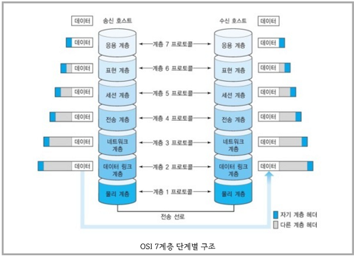

# 📡OSI-7Layer (Open Systems Intercommunication)

#### 🧐 꼭 네트워크는 까먹지 말자
네트워크는 개발자같은 경우엔 코드짜는 일과 관계가 별로 없다고 생각하고 흔히 놓치는 경우가 많아 면접질문에서 꽤나 자주 나온다고 한다. 나는 꽤나 자주 까먹으니까 금방 다시 기억 할 수 있게 오늘도 배운것을 잘 정리해 놓아 본다. (다시 보고 있다면 과거의 나 칭찬해.😆)

OSI-7레이어는 위의 사진과 같이 각 계층 별로 캡슐화(헤더를 붙이는 일)하여 전송 시에는 높은 계층에서 낮은 계층순으로 진행하고 수신 시에는 낮은 계층에서 높은 계층 순으로 진행 된다.  

---

## 🌳 1계층 Physical Layer (물리 계층)

* `아날로그 신호`로 정보를 주고 받을 수 있는 것.
* 이 계층에선 0,1 로 변환해서 주고 받는 기능만 하므로 비트(bit) 단위의 통신을 한다.
* 피지컬 레이어는 `하드웨어`적으로 **PHY 칩**에 구현 되어있음.

---

## 🌱 2계층  DataLink Layer (데이터 링크 계층)

* 같은 네트워크에 있는 여러대의 컴퓨터들이 데이터를 주고 받기 위해 필요한 모듈이다.
* 네트워크 상 주변 장치들 간의 데이터를 전송 하는 역할을 한다.
* 신뢰성 있는 전송을 보장하기 위한 계층이다.
* **MAC 주소**를 사용한다.
* 네트워크 계층에서 패킷을 가져와서 `Framing` 통해 `Frame`이라고 불리는 더 작은 조각으로 세분화한다.
* `Framing` 이란 통신을 위해 앞뒤에 데이터를 감싸는 것. (이더넷 헤더, 트레일러)
	* 이더넷 헤더에는 목적지MAC주소 + 출발지MAC주소 + 유형(상위 계층 프로토콜 종류)으로 이루어지고
	* 모든 계층 중 유일하게 꼬리에도 `트레일러` 라는 정보를 붙이는데 데이터 전송 도중 오류가 발생하는지 용도로 붙인다.
* 프로토콜 : **Ethernet** (LAN(근거리 통신망) 환경에서 거의 절대 다수를 차지함), HDLC, PPP( TCP/IP 기반)
* `하드웨어`적으로 `랜카드`에 구현되어있음
* **네트워크 스위치**가 주로 2계층에서 동작하며 3계층에서 동작하는 스위치는 LAN 구성같은 부가적인 기능도 제공합니다.

---

## ☘ 3계층  Network Layer (네트워크 계층)

* 수많은 네트워크들의 연결로 이루어지는 inter-network속에서 어딘가에 있는 목적지 컴퓨터로 데이터를 전송하기 위해
* 서로 통신하는 두 장치가 동일한 네트워크에 있는 경우에는 네트워크 계층이 필요하지 않다.
* 프로토콜 : **IP**, ICMP(인터넷 제어 메시지 프로토콜) 등
* IP주소를 이용하여 길을 찾고(라우팅)
* 자신 다음의 라우터에게 데이터를 넘겨주는것(포워딩)
* 스위치도 IP를 이용하여 전달할 때는 이 계층에 포함된다.
* 운영체제 커널에 소프트웨어 적으로 구현되어있다.

---

## 🍀4계층 Transport Layer (전송 계층)

* 송/수신 간에 신뢰성 있고 효율적인 데이터 전달을 위하여 `오류 검출, 복, 흐름제어, 중복검사` 등을 수행 한다.
* Port 번호를 사용하여 도착지 컴퓨터의 최종 프로세스까지 도달하게 해주는 모듈이다.
* 운영체제 커널에 소프트웨어적으로 구현되어있다.
* 데이터 전송 단위는 UDP는 데이터그램(datagram) /  TCP면 세그먼트(segment) 이다.
* 프로토콜 : **TCP**, **UDP**, RTP 
  
---

## 🌿 5계층 Session Layer (세션 계층)

* 사용자 간에 동기화된 대화를 설정하고 유지하는 역할을 하며,
* 데이터 전송 중에 발생할 수 있는 오류나 중단을 처리한다.
* 세션에서 설정, 유지, 종료, 데이터 교환과 에러 발생 시 복구를 관리한다.
* 프로토콜 : NetBIOS, RPC, Winsock

---

## 🌴 6계층 Presentaion Layer (표현 계층)

* 데이터의 표현 방식을 결정한다.
	* 해당 데이터가 TEXT인지, 그림인지, GIF인지 JPG인지의 구분하는 것이다.
* 파일 인코딩, 명령어의 포장/압축/암호화 를 담당한다.
	* ex) EBCDIC로 인코딩된 문서 파일을 ASCII로 인코딩된 파일로 바꿔 주는 것이다.

---

## 🍒 7계층  Application Layer(응용 프로그램 계층)
* 주요 프로토콜은 [HTTP](https://www.cloudflare.com/learning/ddos/glossary/hypertext-transfer-protocol-http/)이다.
* 다른 프로토콜에는 POP, SMTP, IMAP는 메일을 송수신하고 보관하고
* SMP,AFP는 LAN안에서 파일을 공유한다.
* 사용자가 간접적으로 사용하는 DNS, DHCP, SSL/TLS 프로토콜도 응용 프로그램 계층이다.
* 애플리케이션 계층은 사용자가 직접 사용하면서 체감할 수 있는 서비스를 제공한다.

---

### 🎈용어 정리
프로토콜이란?
* 컴퓨터 내부에서, 또는 컴퓨터 사이에서 데이터의 교환 방식을 정의하는 규칙 체계의 집합이다.  

**MAC주소란?**  
* Media Access Control  
* 모든 하드웨어 장비를 식별할 수 있는 고유 주소이다. (전 세계적으로 고유한 번호)  

**라우터란?**  
* 네트워크를 연결하는 네트워킹 장로 선택한 위치로의 `지연, 용량 및 속도`와 같은 네트워크 지표 최적의 경로를 지정하며, 다음 경로로 데이터를 전달하는 장비 입니다.  
* 즉 네트워크를 다른 네트워크로 연결하는데 사용됩니다.
* 라우터와 스위치의 차이는 스위치는 LAN을 떠올리고 라우터는 WAN을 떠올리면 좋다.
* 무선 라우터 등은 스위치 기능까지 하기도 합니다.

**허브란?**
- 허브는 다양한 기기들로오는 전기신호를 받아서 신호를 증폭시켜 다른 기기들로 뿌려주는 역할을 합니다.
- 허브에 연결된 기기 집단을 LAN 세그먼트라고 합니다.
- 허브가 스위치와 다른 점은 연결된 기기 중 하나에서 전송된 패킷이 연결된 모든 기기에 브로드캐스팅합니다.

**스위치란?**  
* 네트워크 내의 장치를 연결하고 해당 장치와 데이터 패킷을 주고 받습니다.  
* 라우터와는 달리 여러장치의 네트워크가 아닌 의도된 단일 장치로만 데이터를 전송합니다. 
* MAC 주소를 활용한 데이터 링크 계층에서 작동합니다. (간혹 3계층에서 동작할 때도 있음)

**커널이란?**  
* 운영체제의 핵심이 되는 컴퓨터 프로그램이다.  
* 시스템의 모든것을 완전히 제어한다.  
* 보안 : 하드웨어와 프로세스의 보안을 책임진다.  
* 자원관리 : 시스템 자원을 효율적으로 관리하여 프로그램의 실행을 원할하게 한다. 프로세스에 처리기를 할당 하는것을 스케쥴링이라고 한다.  
* 추상화 : 소프트웨어와 하드웨어 사이에서 일관성 있는 인터페이스를 하드웨어에게 제공 하기 위해 하드웨어 추상화를 사용하는데 이 때 소프트웨어 드라이버를 의지한다.   

**ps. OSI-7Layer 공부시 좋은 영상 (10분 테코톡)**  
https://www.youtube.com/watch?v=1pfTxp25MA8&ab_channel=%EC%9A%B0%EC%95%84%ED%95%9C%ED%85%8C%ED%81%AC

