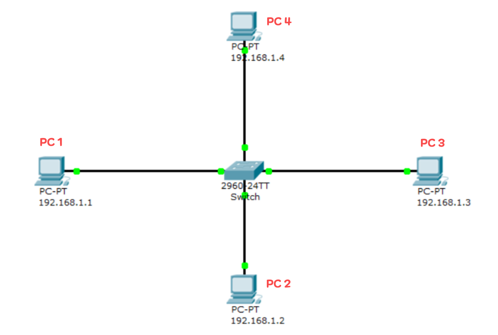

# IP 주소
* Network ID + Host ID로 구성된다.
* Network는 처음 8비트, 둘째자리까지 16비트, 셋째짜리 까지 24비트를 사용할 수도 있고,
* 나머지 비트는 호스트 ID가 사용하게 된다
 
    
  위 사진은 C 클래스로 NetWork가 24비트(세번째까지) 를 사용하는 방법이고
  이때 나머지 8비트는 Host ID가 사용하므로 0 ~ 255까지의 범위를 가질 수 있게된다.
  하지만 여기서 
  * 110.211.168.**0** 은 네트워크 대표 IP로 사용이 불가능하고  
  * 110.211.168.**255** 는 [브로드캐스트](https://github.com/cjp-growth/jiyoul/blob/main/CS/NetWork/README.md#%EB%B8%8C%EB%A1%9C%EB%93%9C%EC%BA%90%EC%8A%A4%ED%8A%B8) IP로 사용이 불가능 하다.  

  때문에 위의 IP에는 254개의 호스트를 가질 수 있게된다.  
  (110.211.168.**1**은 보통 [기본 게이트웨이](https://github.com/cjp-growth/jiyoul/blob/main/CS/NetWork/README.md#%EA%B8%B0%EB%B3%B8-%EA%B2%8C%EC%9D%B4%ED%8A%B8%EC%9B%A8%EC%9D%B4default-gateway) 로 사용됨)  

A 클래스 : 첫 8비트 NetWork ID, 나머지 24비트 Host ID  
B 클래스 : 첫 16비트 NetWork ID, 나머지 16비트 Host ID  
C 클래스 : 첫 24비트 NetWork ID, 나머지 8비트 Host ID  

그 외 D Class와 E Class도 있지만 현재 거의 A,B,C 만 사용된다.  

# 서브넷마스크  
* NetMask 라고도 불린다. (거의 동일 의미로 사용)
* 호스트가 로컬 서브넷에 있는지 아니면 원격 네트워크에 있는지 확인 하기 위해 사용된다.

# 기본 게이트웨이(Default-Gateway)  
* 다른 네트워크로 보내려는 패킷을 어디로 보내야 할지 모를 때에 기본으로 전송해두는 곳이다.  
* 데이터를 외부 네트워크로 라우팅하여 해당 목적지로 전달한다.
* 보통 라우터나 멀티 레이어 스위치(라우팅을 수행하는 스위치) 를 기본 게이트웨이로 설정한다.  
* 기본 게이트웨이의 호스트 ID는 일반적으로 1로 사용된다.

# LAN  
* 근거리 통신망이다.  
* [ARP](https://github.com/cjp-growth/jiyoul/blob/main/CS/NetWork/README.md#arp) Request가 미치는 영역이다.  
* 같은 IP대역을 공유하는 LAN에서 단말간 통신을 하기 위한 통신망이다.  

# 브로드캐스트  
* 네트워크 상에서 메시지를 모든 호스트 또는 장치에게 전송하는 방식이다.  
* 목적지 주소를 브로드캐스트 주소로 설정하여 메세지를 보낸다.  
* 보통 브로드캐스트 IP는 호스트IP의 맨 마지막을 255로 한다. (IPv4 ex : 10.0.0.**255**, 주소 체계에 따라 바뀔 수 있음) 
* 네트워크 관리, 서비스 발견, ARP 요청과 같은 목적으로 사용 될 수 있다.
* 일반적으로 `로컬 네트워크에만 유효`하며 `라우터를 통해 다른 네트워크로 전파되지는 않지만` 로컬 네트워크 내에 모든 호스트에게 전송 되므로 **트래픽의 부하를 초래 할 수 있어 필요한 경우**에만 사용 해야한다.

# ARP(Address Resolution Protocol)   
* IP주소와 MAC 주소를 일대일 대응하여 테이블로 정리한다.  
* LAN 방식에서 IP와 목적지를 찾아갈 때 사용된다.  
  
  
## 🍒ARP 생성 과정  
  
1. **PC 1** 에서 **PC 3** 로 데이터를 전달하려고 한다.  
2. 먼저 [Routing Table]()을 보고 **PC 3**가 자기와 같은 LAN에 속한다는 것을 확인한다.  
3. PC 2의 MAC 주소를 알기위해 [브로드캐스팅](https://github.com/cjp-growth/jiyoul/blob/main/CS/NetWork/README.md#%EB%B8%8C%EB%A1%9C%EB%93%9C%EC%BA%90%EC%8A%A4%ED%8A%B8)을 통하여 ARP Request(송신자의 MAC/IP주소, 목적지IP)를 뿌린다.  
4. **PC2, PC3, PC4**은 ARP Request를 받고 **PC3만** 반응하여 자신의 MAC 주소를 수신자 **PC1에게** ARP Response(송신자MAC/IP 주소, 수신자MAC/IP주소)를 보낸다.  
5. **PC1**은 해당 ARP Response 를 받아 ARP 테이블에 저장하고 이후 해당 테이블을 참조하여 IP+MAC 로 통신 할 수 있습니다.  
  
# HOP  
* 보통 패킷이 시작점 에서 목적지까지 이동하는데 필요한 라우터(스텝)의 수를 의미한다.
* 하나의 네트워크 노드에서 다음 노드로 이동할 때마다 홉이라고 부른다.
* 홉 수가 적을 수록 네트워크 성능이 좋지만 무조건 더 좋은것은 아니다. 대역폭, 라우터의 성능, 네트워크 혼잡도 등에 따라 달라질 수 있기 때문이다.
* 대표적으로 RIP 프로토콜이 해당 홉 수를 기반으로 최단 경로를 결정한다.
* 'traceroute' 명령어를 통해 각 홉에 걸린 시간, 병목 지점을 파악 할 수 있다.
* 네트워크 전송 중 홉이 최대 255개가 넘으면 해당 전송을 버린다.
  
  
# DHCP (Dynamic Host Configuration Protocol)
* 네트워크에서 IP 주소, 서브넷 마스크, 기본 게이트웨이, DNS 서버 등 기타 네트워크 구성 정보를 자동으로 할당하는 프로토콜이다.
* 보통 가정용엔 공유기라고 불리는 장치에 내장되어 있다.
* DHCP 서버는 네트워크에 하나 이상 존재할 수 있다.
* 클라이언트는 할당된 IP 주소의 유효 기간을 확인하여 갱신해야 한다.

## 🍒 DHCP 동작순서(DORA 프로세스)  
1. **Discover** : 네트워크에 연결된 클라이언트 장치가 부팅될 때 클라이언트 장치가 DHCP 서버를 찾기 위해 `DHCP Discover` 메세지를 브로드캐스트로 전송합니다.   
	- DHCP Discover : **Transaction ID**, IP는 아직 생성되기 전이므로 0.0.0.0, 자신 MAC 주소, 목적지 주소 [255.255.255.255](https://github.com/cjp-growth/jiyoul/blob/main/CS/NetWork/README.md#%EB%B8%8C%EB%A1%9C%EB%93%9C%EC%BA%90%EC%8A%A4%ED%8A%B8), 사용자 지정한 서브넷 마스크/기본 게이트웨이 정보가 포함되어 있다.
2. **Offer**  : DHCP 서버가 Discover 메세지를 받게 되면 사용 가능한 IP 주소와 네트워크 구성 정보를 `DHCP Offer`로 브로드캐스트 또는 유니캐스트 하여 해당 클라이언트에게 전송합니다.   
	- DHCP Offer : **Discover와 동일한** Transaction ID, DHCP 서버 IP, 할당 가능한 IP 주소, 클라이언트 IP 주소를 유지하려는 시간, 서브넷/기본게이트웨이/DNS서버 등 정보가 포함 되어있다.  
	- 이 때 클라이언트가 보낸 DHCP Discover안에 브로드캐스트 flag 값에 따라 목적지가 255.255.255.255 이거나 MAC 주소로 찾아 유니캐스트 하거나 함.  
3. **Request** : 클라이언트는 DHCP 서버(단일 또는 다중)에게 Offer를 받은 후 하나를 골라 `DHCP Request` 메세지를 브로드캐스트 하여 전송해 해당 IP 주소 할당 요청합니다. (하나 골랐다면 나머지는 무시함.)  
	* DHCP Request : **Discover와 동일한** Transaction ID, 클라이언트 MAC 주소, 요청할 IP, 하나 골른 DHCP 서버 IP, 클라이언트 IP 주소를 유지하려는 시간 등이 포함 된다.  
4. **Acknowledge** : Request 정보에 해당 하는 DHCP 서버는 Request를 받아 해당 클라이언트의 IP를 확정 한뒤 Offer와 같이 HCP Discover안에 브로드캐스트 flag 값에 따라 브로드 또는 유니캐스트를 하여 IP주소와 네트워크 설정정보를 전송해준다.  
	* DHCP Acknowledge : **Discover와 동일한** Transaction ID, 클라이언트에게 할당한 IP 주소, DHCP 서버의 IP 주소, 클라이언트 MAC 주소, 클라이언트 IP 주소를 유지하려는 시간, 네트워크 설정 정보 등이 포함된다.  

위의 4가지 동작을 완료 하면 이제 클라이언트와 네트워크가 연결된 상태가 되어 데이터를 전송하거나 받을 수 있게 됩니다.👻